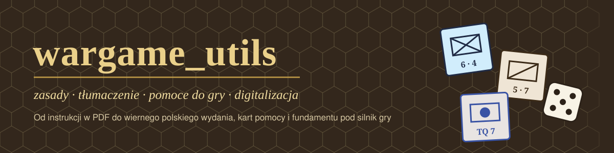
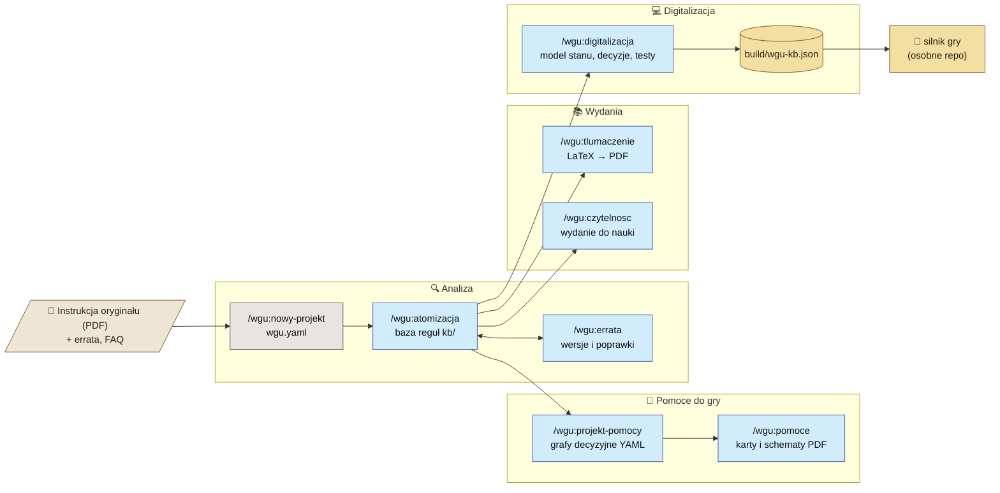
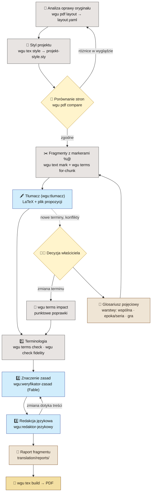
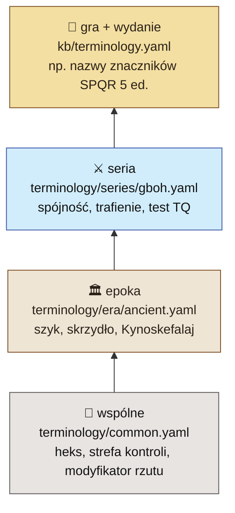
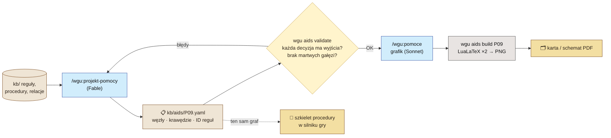

<p align="center">
  
</p>

<p align="center">
  
  
  
  
</p>

**wargame_utils** to warsztat do pracy z instrukcjami historycznych gier wojennych: od PDF-u wydawcy do wiernego
polskiego wydania w oprawie oryginału, kart i schematów pomocy oraz bazy wiedzy, na której można zbudować
komputerową wersję gry. Narzędzie składa się z dwóch części:

| | Co to jest | Kto pracuje |
|---|---|---|
| 🧩 **Plugin Claude Code `wgu`** | skille `/wgu:*` i wyspecjalizowani agenci (analityk zasad, tłumacz, weryfikator zasad, redaktor językowy, projektant pomocy, grafik, architekt digitalizacji) | modele językowe, każdy dobrany do zadania |
| 🛠️ **CLI `wgu` (Python)** | wszystko, co da się zrobić bez modelu: ekstrakcja i pomiar PDF, kontrola glosariusza i wierności, kompilacja LaTeX, walidacja, eksport | skrypty, deterministycznie i tanio |

> [!IMPORTANT]
> Tłumaczenia i pomoce tworzone tym narzędziem są **nieoficjalne**. Nie publikuj materiałów wydawców bez ich zgody
> i nie używaj ich znaków towarowych w sposób sugerujący oficjalne wydanie.

---

## 🗺️ Mapa całości



**Zasada:** baza wiedzy `kb/` (YAML) jest jedynym źródłem prawdy o zasadach. Tłumaczenie, pomoce i digitalizacja
korzystają z niej zamiast czytać PDF od nowa.

---

## 🚀 Szybki start

**1. Instalacja narzędzia** (raz, na komputerze)
```bash
git clone git@github.com:yautay/wargame-utils.git C:/dev/wargame_utils
```
```bash
pip install -r C:/dev/wargame_utils/requirements.txt
```
Potrzebny też **LuaLaTeX** (MiKTeX lub TeX Live). Pułapki środowiska: [templates/docs/pulapki.md](templates/docs/pulapki.md).

**2. Repozytorium gry** (jedno repo na jedną grę, w nim tylko PDF instrukcji)
```text
mojagra/
├── docs/rules.pdf
└── .claude/settings.json      ← włącza plugin wgu (przykład niżej)
```
```json
{
  "extraKnownMarketplaces": {
    "wargame-utils": { "source": { "source": "directory", "path": "C:/dev/wargame_utils" } }
  },
  "enabledPlugins": { "wgu@wargame-utils": true }
}
```
Albo z terminala:
```bash
claude plugin marketplace add C:/dev/wargame_utils --scope project
```
```bash
claude plugin install wgu@wargame-utils --scope project
```

**3. Pierwsza sesja Claude Code w repozytorium gry**
```text
/wgu:nowy-projekt          → wgu.yaml, rozpoznanie źródeł, kolor zmian wersji, fonty
/wgu:atomizacja            → baza reguł kb/ (najdłuższy krok, model Fable)
/wgu:tlumaczenie --proba   → próba na 5 fragmentach, zanim ruszy całość
```

---

## 🖋️ Tłumaczenie: jak to działa

Tłumaczenie jest najważniejszą funkcją narzędzia. Celem jest przekład, który czyta się jak dobrze napisaną polską
instrukcję, a w którym **każdy przepis znaczy dokładnie to samo co w oryginale**. Płynność, która zmienia warunek,
obowiązek albo wyjątek, jest błędem.



### Trzy przebiegi weryfikacji, trzech różnych wykonawców

| Przebieg | Sprawdza | Kto | Nie sprawdza |
|---|---|---|---|
| **1. Terminologia** | odrzucone i nieaktualne formy, terminy sporne, liczby, odsyłacze, sygnały modalności (`może`/`musi`/`nie wolno`), zakres i przeczenia | skrypty `wgu terms check`, `wgu check fidelity` | znaczenia ani stylu |
| **2. Znaczenie zasad** | modalność, negacja, alternatywy, zakres wyjątków, kolejność, limity i ich odniesienie, granice (≥ / >) | agent `wgu:weryfikator-zasad` (Fable) | stylu |
| **3. Redakcja językowa** | kalki, neologizmy, szyk, typografia, zbędne glosy | agent `wgu:redaktor-jezykowy` | terminów zatwierdzonych |

> [!NOTE]
> W próbie na SPQR ([docs/proby](docs/proby/2026-10-04-spqr-tlumaczenie.md)) skrypt wykrył 5 z 6 wstrzykniętych
> błędów znaczenia, bez fałszywych alarmów. Ślepy weryfikator wykrył 6 z 6, łącznie z subtelną zmianą progu
> „osiągnie lub przekroczy” → „przekroczy”. Obecność terminów z glosariusza **nie** dowodzi poprawności przekładu.

### Glosariusz: pojęcie w kontekście, nie słowo



Warstwa bardziej szczegółowa wygrywa, a nadpisanie musi być jawne (`overrides`). Jedno angielskie słowo może mieć
kilka pojęć (*line* jako grupa jednostek ≠ *Line Command*). Dwie różne mechaniki nigdy nie dzielą odpowiednika
(*rout* ≠ *withdrawal* ≠ *retreat*). Przykładowy rekord:

```yaml
- id: gboh.tq-check
  source_term: TQ Check
  sense: Rzut kością porównywany z wartością TQ; wynik wyższy od wartości daje trafienia.
  disambiguation: Test, nie parametr (zob. gboh.tq-rating).
  pl: test TQ
  pl_forms: [test TQ, testu TQ, teście TQ, testem TQ, testy TQ, testów TQ]
  rejected: [{pl: rzut na TQ, reason: wariant PL3; jedno pojęcie = jeden termin}]
  status: proposal          # proposal → approved (tylko decyzja właściciela) / disputed / deprecated
  evidence:
    - {source: GMT-SPQR-PL3, where: s. 15, form: test TQ, supports: usage-in-games}
```

`supports` mówi, **co** potwierdza dowód. To, że słowo istnieje w słowniku (`existence`), nie znaczy, że jest
właściwym odpowiednikiem mechaniki. Przykład: *harcownik* w WSJP to uczestnik pojedynku przed bitwą, a nie *skirmisher*.
Źródła i ich ocena: [skills/tlumaczenie/references/zrodla.md](skills/tlumaczenie/references/zrodla.md).

### Oprawa jak w oryginale

Każda instrukcja dostaje własny styl wygenerowany z pomiaru jej PDF-u: format, kolumny, fonty (wolne zamienniki),
nagłówki, numery reguł, ramki uwag z kolorami, paginy. Tekst przekładu używa tylko makr wspólnego API
(`wgu-base.sty`: `\regula`, `\wyjatek`, `uwagahist`, `uwagaprojektanta`, `przyklad`…), więc zmiana oprawy nie wymaga
zmian w tekście.

```text
wgu pdf layout oryginal.pdf translation/layout.yaml --pages 6-40     # pomiar → szkic specyfikacji
wgu tex style translation/layout.yaml spqr-style.sty                 # styl projektu + wgu-base.sty
wgu tex build test.tex                                                # kompilacja, raport błędów, PNG
wgu pdf compare oryginal.pdf 14 test.pdf 1 porownanie.png             # strony obok siebie
```

---

## 🧭 Pomoce do gry



---

## 📦 Skille

| Skill | Co robi | Model |
|---|---|---|
| `/wgu:nowy-projekt` | zakłada `wgu.yaml`, rozpoznaje źródła i oprawę | — |
| `/wgu:atomizacja` | baza reguł: reguły z cytatami, definicje, tabele, procedury, relacje, niejasności, scenariusze | Fable |
| `/wgu:errata` | porównanie wersji, errata, FAQ, rozstrzygnięcia, poprawki tłumaczenia | Fable / redaktor |
| `/wgu:tlumaczenie` | tłumaczenie LaTeX → PDF z glosariuszem, oprawą oryginału i trzema przebiegami weryfikacji | tłumacz + Fable + redaktor |
| `/wgu:czytelnosc` | wydanie do nauki z kontrolą wierności | redaktor |
| `/wgu:projekt-pomocy` | specyfikacje pomocy (grafy decyzyjne) | Fable |
| `/wgu:pomoce` | karty i schematy w TikZ | Sonnet |
| `/wgu:digitalizacja` | model stanu, decyzje, losowość, modyfikatory, testy given/when/then, pakiet JSON | Fable |
| `/wgu:regula` | szybkie wyszukanie reguły lub terminu w bazie | Haiku |

## ⌨️ CLI

```text
wgu init [--setup --pdf F --image F… --no-git --no-plugin] | config
wgu pdf    analyze | extract | images | render | layout | compare
wgu kb     import-legacy | lint | render | show ID… | stats | export
wgu terms  lint | show | check TEX… | impact ID --tex … --src … | for-chunk SRC | glossary-tex OUT | import-md
wgu text   mark SRC OUT                   # markery %@ przed numerami reguł
wgu check  fidelity SRC TEX…              # liczby, odsyłacze, modalność, przeczenia, zakres, terminy
wgu aids   validate [ID…] | build ID…
wgu tex    build FILE [--render DPI] | style LAYOUT.yaml OUT.sty
```
Bez instalacji: `python C:/dev/wargame_utils/wgu.py …`. Po `pip install -e .` wystarczy `wgu …`.

## 📁 Repozytorium gry po pełnym przebiegu

```text
mojagra/
├── wgu.yaml                  konfiguracja projektu
├── docs/rules.pdf            oryginał
├── kb/                       baza wiedzy (YAML, źródło prawdy)
│   ├── rules/*.yaml          atomowe reguły z cytatami
│   ├── terminology.yaml      glosariusz warstwy gry
│   ├── aids/*.yaml           specyfikacje pomocy
│   └── digital/*.yaml        fundament digitalizacji
├── translation/              fragmenty, propozycje, decyzje, raporty, layout.yaml
├── tex/ + <gra>-style.sty    tłumaczenie LaTeX (+ wgu-base.sty)
├── pomoce/                   karty i schematy (TikZ → PDF)
└── build/wgu-kb.json         pakiet dla projektu digitalizacji
```

## 📚 Dokumentacja

- [Architektura](docs/ARCHITECTURE.md) · [Modele i koszty](docs/MODELE.md) · [Digitalizacja](docs/DIGITALIZACJA.md)
- Tłumaczenie: [polityka terminologiczna](skills/tlumaczenie/references/polityka-terminologiczna.md) ·
  [styl przepisów](skills/tlumaczenie/references/styl-przepisow.md) ·
  [wierność zasad](skills/tlumaczenie/references/wiernosc-zasad.md) ·
  [weryfikacja](skills/tlumaczenie/references/weryfikacja.md) · [źródła](skills/tlumaczenie/references/zrodla.md)
- Próby: [SPQR, 2026-10-04](docs/proby/2026-10-04-spqr-tlumaczenie.md)

## 🧪 Testy

```bash
python -m pytest tests
```
